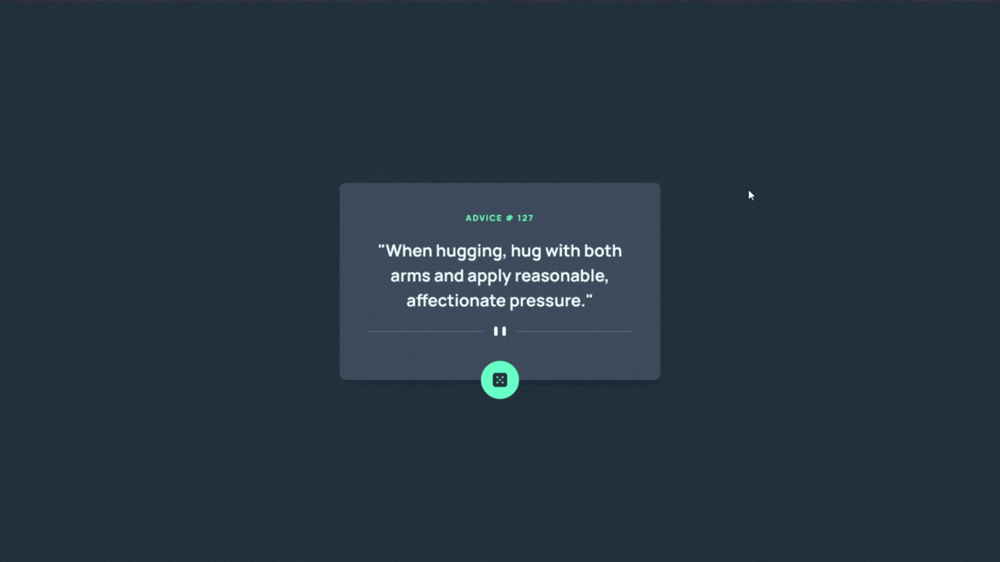
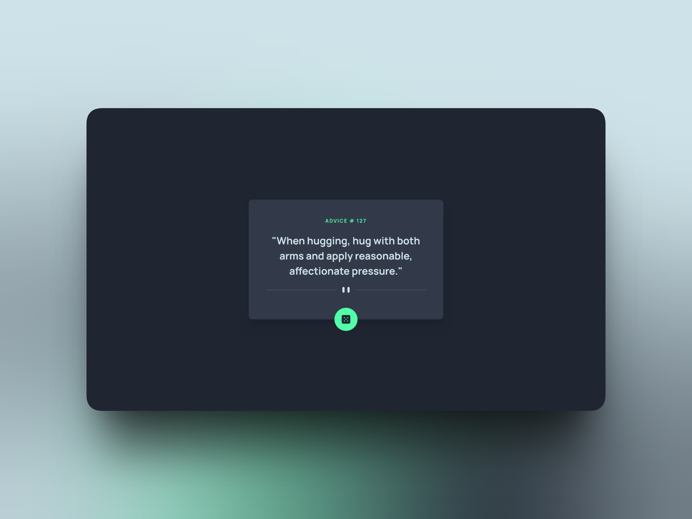

# Frontend Mentor - Advice generator app solution

This is a solution to the [Advice generator app challenge on Frontend Mentor](https://www.frontendmentor.io/challenges/advice-generator-app-QdUG-13db). Frontend Mentor challenges help you improve your coding skills by building realistic projects.



## Table of contents

- [Overview](#overview)
  - [The challenge](#the-challenge)
  - [Screenshot](#screenshot)
  - [Links](#links)
- [My process](#my-process)
  - [Built with](#built-with)
  - [What I learned](#what-i-learned)
  - [Useful resources](#useful-resources)
- [Author](#author)

## Overview

### The challenge

Users should be able to:

- View the optimal layout for the app depending on their device's screen size
- See hover states for all interactive elements on the page
- Generate a new piece of advice by clicking the dice icon

### Screenshot

📱 Preview 💻



### Links

- Solution URL: [https://www.frontendmentor.io/solutions/advice-generator-app---nextjs-tailwind-shadcn-YwnFw02ERe](https://www.frontendmentor.io/solutions/advice-generator-app---nextjs-tailwind-shadcn-YwnFw02ERe)
- Live Site URL: [https://fermop-advice-generator-app-nextjs.vercel.app/](https://fermop-advice-generator-app-nextjs.vercel.app/)

## My process

### Built with

- Semantic HTML5 markup
- CSS custom properties (Tailwind v4 Theme)
    - Flexbox
    - [Tailwind CSS](https://tailwindcss.com/) - For styling
- Mobile-first workflow
- [React](https://es.react.dev/) - JS library
- [Next.js](https://nextjs.org/) - React framework
- [TypeScript](https://www.typescriptlang.org/) - For type safety
- [Shadcn](https://ui.shadcn.com/docs/components/radix/skeleton) - Skeleton Loading Component

### What I learned

I struggled a bit with the position of the button. I found out the browser positions the left edge of your button at the 50% mark of the parent container. This means the button starts at the center and extends to the right.

To truly center it, you need to move the button backwards (to the left) by exactly half of its own width. Using `-translate-x-1/2` fixes it!

```html
<button 
  onClick={handleNewAdvice}
  disabled={isLoading}
  className={`absolute -bottom-8 left-1/2 -translate-x-1/2 w-fit p-5 bg-primary-green-300 rounded-full cursor-pointer duration-200 ${!isLoading && 'hover:shadow-neon hover:shadow-primary-green-300'}`}
  aria-label="Generate new advice"
>
```

### Useful resources

- [Shadcn](https://ui.shadcn.com) - This library helped me manage the frontend part for the skeleton loading component.

## Author

- Frontend Mentor - [@fermop](https://www.frontendmentor.io/profile/fermop)
- Linkedin - [Fernando Pérez Mojica](www.linkedin.com/in/fernando-pérez-mojica-71b28a361)